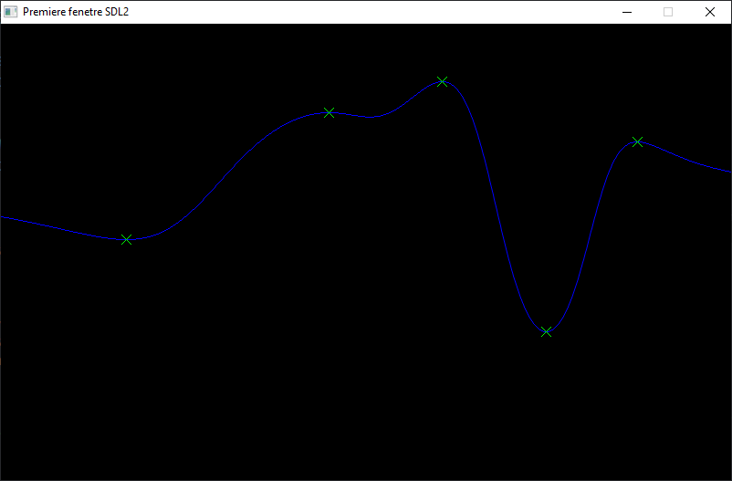

# Interpolation de courbe 2D

>Auteur: Raphaël Roumat

Projet personnel d'interpolation de courbe en fonctions de points données par un utilisateur.

Bibliothèques utilisés:

- `SDL2`: Simple DirectMedia Layer, prémitives de gestion de fenêtres
- `SDL2_gfx` addon SDL pour graphiques basiques

## Méthode d'interpolation:

Pour chaque point X de la fenêtre on détermine sa position Y en fonction des points donnés par l'utilisateur. Plus un point est proche, plus il impact la position en Y.

## Résultat

